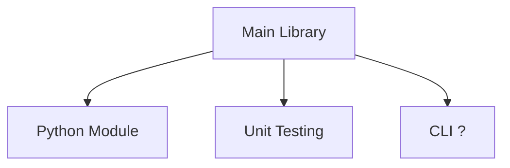
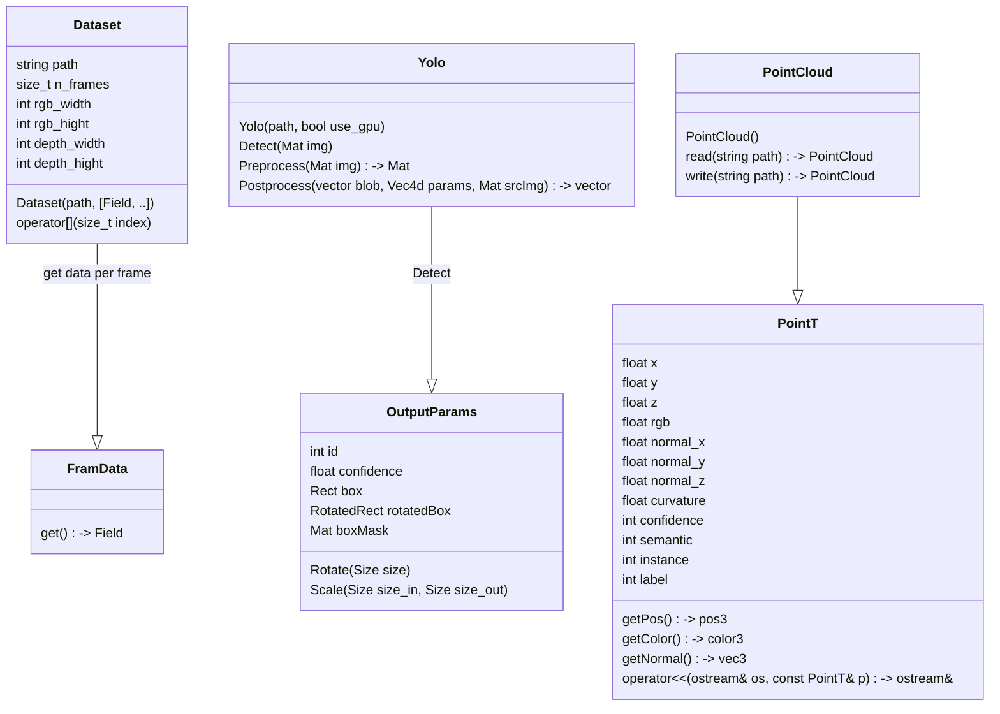
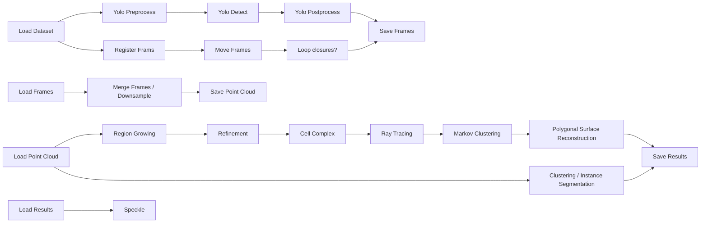

# Linkm ML 
**Aka. _ReuseExplorer_**

### TODO:
- [x] Add instructions for installing Dependencies
    - [x] Add instructions for installing OpenCV and PCL
- [x] Add an explanation of the project structure
- [ ] Implement Regiongrowing based on `pcl::RegionGrowing< PointT, NormalT >` \
See `10.1016/j.autcon.`2022.104250` for reference.
- [x] Separate read, register, and merge functions to enable working with larger datasets, that don't fit in memory.
- [ ] Fix pointer issues. [see](https://pybind11.readthedocs.io/en/stable/advanced/smart_ptrs.html?highlight=pointers)
- [ ] Implement Buffer protocol for `PointCloud` to enable direct access to the data from Python. [see](https://pybind11.readthedocs.io/en/stable/advanced/pycpp/numpy.html)

### Notes
Scanning app:
[StrayScanner](https://github.com/strayrobots/scanner)

[Speckle](https://speckle.systems/); an open data platform for AEC. 

[Speckle Automate (Video)](https://www.youtube.com/watch?v=6_rXXGpnfb4); a CI/CD like flow for triggering custom functions on Speckle data.


Some bench marking:
```shell
Number of frames: 2500 -> ( start: 0; step: 4; end: 9996 ) 6.58% 
[polyscope] Backend: openGL3_glfw -- Loaded openGL version: 3.3.0 NVIDIA 535.154.05
[============================================================] (2500/2500) 100% -     0s -  48 threads - (Loading data)
Total time: 00:02:10s (Loading data)
[============================================================] (2500/2500) 100% -     0s -  48 threads - (Preprocessing)
Total time: 00:02:06s (Preprocessing)
[============================================================] (2500/2500) 100% -     0s -   1 threads - (Running Inference)
Total time: 00:01:15s (Running Inference)
[============================================================] (2500/2500) 100% -     0s -  48 threads - (Postprocessing)
Total time: 00:00:00s (Postprocessing)
[============================================================] (2500/2500) 100% -     0s -  48 threads - (Computing normals)
Total time: 00:03:33s (Computing normals)
[============================================================] (2500/2500) 100% -     0s -  48 threads - (Saving clouds)
Done
```


## Description
This is a tool for processing scan data captured with an iPhone / iPad in the context of mapping buildings. The goal is to segment and label objects in the point cloud and reconstruct a simplified 3D model on a room-by-room detail scale.

Project structure:


Classes Diagram:


Flow Diagram:



## Build instructions:
Clone repository recursively:

```shell
git clone --recursive https://github.com/linkarkitektur/linkml_cpp
# --recursive is used to clone submodules in (extern)
```

Install dependencies:
OpenCV and PCL have been compiled from source and are not included but need to be installed separately.

### Dependencies:
- PCL (Manually compiled with CUDA support)
- OpenCV (Manually compiled with CUDA support)
- CGAL
    - Eigen3 (Required by CGAL and Markov Clustering) 
    - TBB (Threading Building Blocks for GGAL parralelization)
    - SCIP (Fallback LIP solver in CGAL)
    - Gurobi (Commercial, but free for academic use)
- Embree
- HDF5 (Currently not used, but included in the project)

*Generally, it would_ be great to have all dependencies self-contained in the project in _the extern folder as submodules_.*

#### OpenCV
Open CV needs to be compiled with CUDA support for inference on the GPU.
The branch needs to be `4.x` and commit  `0c6fc763f4` has been confirmed to work.

```shell

Dependencies:
- CUDA
- cuda-toolkit ([Instructions](https://developer.nvidia.com/cuda-downloads))
- cuDNN (8.9.7) ([Arechive](https://developer.nvidia.com/rdp/cudnn-archive))

*There were probably more dependencies, but I don't remember them. Let's extend the list when we get there*

**Note**: Nvidia's instruction installs the [current](https://developer.nvidia.com/cudnn-downloads) cuDNN version, which is (9.0.0). This does **not** seem compatible with [OpenCV](https://github.com/opencv/opencv/issues/24983). Here are the archives for [cuDNN 8.9.7](https://developer.nvidia.com/rdp/cudnn-archive)

```shell
mkdir opencv && cd opencv

git clone git@github.com:opencv/opencv_contrib.git
got clone git@github.com:opencv/opencv.git
cd opencv

mkdir build && cd build

cmake -D CMAKE_BUILD_TYPE=Release -D CMAKE_INSTALL_PREFIX=/usr/local -D OPENCV_EXTRA_MODULES_PATH=../../opencv_contrib/modules -D WITH_CUDA=ON ..

make -j48 #Number of cores

sudo make install

# Most of the flags below show be enable by using -D WITH_CUDA=ON

#cmake -D CMAKE_BUILD_TYPE=Release -D CMAKE_INSTALL_PREFIX=/usr/local -D OPENCV_EXTRA_MODULES_PATH=../../opencv_contrib/modules -D WITH_CUDA=ON -D WITH_CUDNN=ON -D CUDA_FAST_MATH=1 -D ENABLE_FAST_MATH=1 -D WITH_GTK=ON -D WITH_TBB=ON -D WITH_FFMPEG=ON -D INSTALL_PYTHON_EXAMPLES=OFF  -D OPENCV_DNN_CUDA=ON -D CUDA_GENERATION=Auto -D CUDA_FAST_MATH=ON  -D WITH_NVCUVID=OFF -D WITH_NVCUVENC=OFF  ..

```


#### PCL

Maybe we don't need the new version of PCL, but I compiled it from source while looking for some features (CUDA acceleration) that I didn't end up using.

Again, not sure what all the dependencies are, but those are the ones that are listed online.

Dependencies:
- Boost (also required by GCAL)
- Eigen (also required by CGAL)
- Flann
- VTK
- QHull
- OpenNI
- OpenNI2
- CUDA


Official Instructions [here](https://pcl.readthedocs.io/projects/tutorials/en/latest/compiling_pcl_posix.html#compiling-pcl-posix).

```shell
git clone git@github.com:PointCloudLibrary/pcl.git
cd pcl
mkdir build && cd build
cmake -DCMAKE_BUILD_TYPE=Release ..

# I'm not sure if there were any other flags, but I think I used the defaults.
# Otherwise let's add them here.
```


#### Export Yolo v8.1 model
```python
from ultralytics import YOLO

model = YOLO('yolov8x-seg.pt') 
model.export(format="onnx", simplify=True)
```


### Debugging
I have found a way in VSCode where I can launch a Python process and attach a debugger to it and then gdb to the C++ process.
Alternatively, now that the data loading is also part of the C++ code, we could also just call it a regular CLI application.

launch.json with the  [Python C++ Debugger](https://marketplace.visualstudio.com/items?itemName=benjamin-simmonds.pythoncpp-debug)
 pluging.

```json
{
    "version": "0.2.0",
    "configurations": [
        {
            "name": "My (gdb) Attach",
            "type": "cppdbg",
            "request": "attach",
            "processId": "",
            "setupCommands": [
                {
                    "description": "Enable pretty-printing for gdb",
                    "text": "-enable-pretty-printing",
                    "ignoreFailures": false
                },
                {
                    "description": "Set Disassembly Flavor to Intel",
                    "text": "-gdb-set disassembly-flavor intel",
                    "ignoreFailures": true
                }
            ]
        },
    ]
}
```